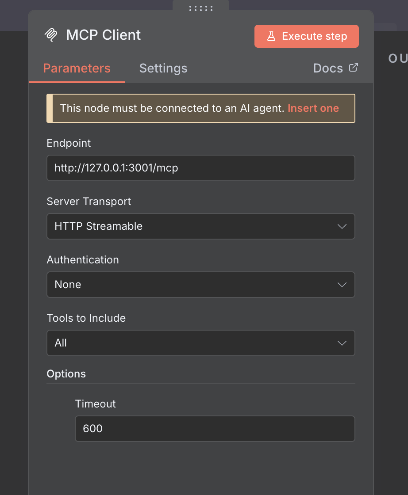

# Automatic report generation with n8n, markitdown-mcp, and Marp

This repository demonstrates an automated workflow that generates reports in the style of previous PowerPoint reports using n8n, markitdown-mcp, and Marp. The flow converts existing PowerPoint and Excel files into Markdown, processes the Markdown, and exports slides (PPTX/PDF) via Marp.


## Prerequisites
- Node.js (recommended: 16+)
- n8n
- markitdown-mcp (HTTP mode)
- Marp CLI (or Marp extension for VS Code)

## Usage

### 1. Start [n8n](https://github.com/n8n-io/n8n)
Start n8n in your environment. Basic example:
```
npx n8n
```

Import the workflow from `n8n/workflow.json` into your n8n instance.

### 2. Start [markitdown-mcp](https://github.com/microsoft/markitdown/tree/main/packages/markitdown-mcp)
Run markitdown-mcp as an HTTP server so the MCP client node in n8n can call its methods:
```
markitdown-mcp --http --host 127.0.0.1 --port 3001
```

To verify the server is running, call the RPC endpoint:
```
curl -v http://127.0.0.1:3001/mcp/ \
  -H "Content-Type: application/json" \
  -H "Accept: application/json, text/event-stream" \
  -d '{"jsonrpc":"2.0","id":"1","method":"tools/list","params":{}}'
```

Configure the n8n "MCP Client" node to point at the markitdown-mcp server.



### 3. Convert Markdown to Powerpoint with Marp
n8n's "Execute Command" node doesn't work, so run [Marp CLI](https://github.com/marp-team/marp-cli) manually or use [the Marp extension for VS Code](https://github.com/marp-team/marp-vscode) to convert the generated Markdown file to PPTX or PDF.
There are [some issues related to that](https://community.n8n.io/t/the-execute-command-node-runs-indefinitely/158753
), but I cannot find a solution yet.

```
npx @marp-team/marp-cli input.md --pptx --allow-local-files 
```
